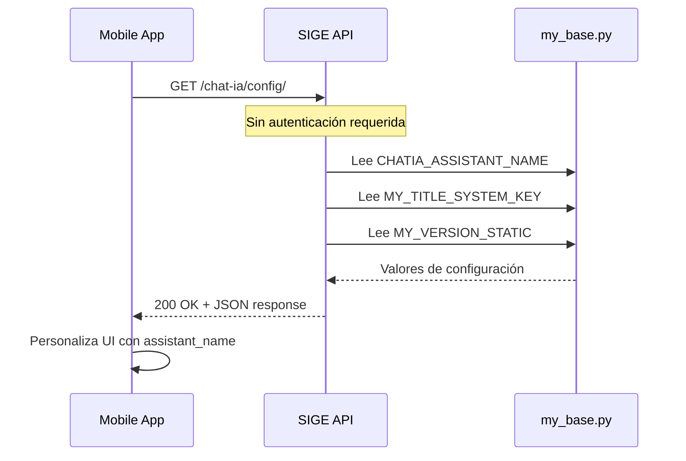

# ChatIA Public Config API Specification

## Resumen

Endpoint público para obtener configuración no sensible del módulo ChatIA. Diseñado para que aplicaciones frontend/móviles puedan personalizar la interfaz de usuario sin requerir autenticación.

---

## Endpoint

### GET `/api/v1_0_0/chat-ia/config/`

Retorna los valores de configuración pública de ChatIA.

#### Características

| Atributo | Valor |
|----------|-------|
| **Autenticación** | NO REQUERIDA (público) |
| **Rate Limiting** | No aplica |
| **Método HTTP** | GET |
| **Content-Type Response** | `application/json` |

---

## Request

### Headers

No se requieren headers de autenticación.

```http
GET /api/v1_0_0/chat-ia/config/ HTTP/1.1
Host: sige.innotech-solutions.com.ec
Accept: application/json
```

### Parámetros

Este endpoint no acepta parámetros.

---

## Response

### Respuesta Exitosa (200 OK)

```json
{
    "success": true,
    "data": {
        "assistant_name": "Amani",
        "platform_name": "SIGE",
        "platform_version": "0.1.1"
    },
    "status_code": 200
}
```

### Campos de Respuesta

| Campo | Tipo | Descripción | Fuente |
|-------|------|-------------|--------|
| `assistant_name` | `string` | Nombre del asistente IA con el que se presenta | `CHATIA_ASSISTANT_NAME` en `base/my_base.py` |
| `platform_name` | `string` | Nombre corto de la plataforma | `MY_TITLE_SYSTEM_KEY` en `base/my_base.py` |
| `platform_version` | `string` | Versión actual de la plataforma | `MY_VERSION_STATIC` en `base/my_base.py` |

---

## Configuración del Backend

Los valores expuestos provienen de variables de entorno configurables:

### Archivo: `base/my_base.py`

```python
# Identidad del asistente (nombre con el que se presenta)
CHATIA_ASSISTANT_NAME = config('CHATIA_ASSISTANT_NAME', default='Amani', cast=str)

# Nombre del sistema
MY_TITLE_SYSTEM_KEY = 'SIGE'

# Versión
MY_VERSION_STATIC = '0.1.1'
```

### Variables de Entorno

| Variable | Default | Descripción |
|----------|---------|-------------|
| `CHATIA_ASSISTANT_NAME` | `Amani` | Nombre del asistente IA |

> [!NOTE]
> `CHATIA_ASSISTANT_NAME` es configurable vía `.env`. Los demás valores (`MY_TITLE_SYSTEM_KEY`, `MY_VERSION_STATIC`) son constantes directas en el código.

---

## Seguridad

Este endpoint está diseñado para ser **completamente público** y seguro:

### ✅ Valores Expuestos (Seguros)
- Nombre del asistente (personalización UI)
- Nombre de la plataforma
- Versión de la plataforma

### ❌ Valores NO Expuestos
- API keys (`OPENAI_API_KEY`)
- Configuraciones internas (`CHATIA_MAX_TOKENS`, `CHATIA_TEMPERATURE`)
- Rate limits internos
- Cualquier secreto o credencial

### Implementación

```python
class PublicConfigView(APIView):
    permission_classes = []  # Público - sin autenticación
    authentication_classes = []  # Omitir validación de tokens
```

---

## Casos de Uso

### 1. Personalización de UI en App Móvil

```javascript
// React Native / Flutter
const response = await fetch('https://sige.innotech-solutions.com.ec/api/v1_0_0/chat-ia/config/');
const data = await response.json();

// Usar el nombre del asistente en la interfaz
setAssistantName(data.data.assistant_name);  // "Amani"
```

### 2. Splash Screen / Inicio de App

```dart
// Flutter
Future<void> loadConfig() async {
  final response = await http.get(
    Uri.parse('$baseUrl/api/v1_0_0/chat-ia/config/')
  );
  final config = jsonDecode(response.body);
  
  AppConfig.assistantName = config['data']['assistant_name'];
  AppConfig.platformVersion = config['data']['platform_version'];
}
```

### 3. Cache de Configuración

> [!TIP]
> Como estos valores cambian muy raramente, se recomienda cachearlos localmente con un TTL largo (24 horas o hasta el reinicio de la app).

```javascript
const CONFIG_CACHE_KEY = 'chatia_public_config';
const CONFIG_CACHE_TTL = 24 * 60 * 60 * 1000; // 24 horas

async function getConfig() {
    const cached = await AsyncStorage.getItem(CONFIG_CACHE_KEY);
    if (cached) {
        const { data, timestamp } = JSON.parse(cached);
        if (Date.now() - timestamp < CONFIG_CACHE_TTL) {
            return data;
        }
    }
    
    const fresh = await fetchConfig();
    await AsyncStorage.setItem(CONFIG_CACHE_KEY, JSON.stringify({
        data: fresh,
        timestamp: Date.now()
    }));
    return fresh;
}
```

---

## Respuestas de Error

### Error Interno (500)

```json
{
    "success": false,
    "message": "Error al obtener configuración",
    "status_code": 500
}
```

> [!NOTE]
> Este error es extremadamente raro ya que el endpoint solo lee constantes. Solo ocurriría por un error de importación en el servidor.

---

## Flujo de Arquitectura



---

## Testing

### cURL

```bash
# Producción
curl -X GET https://sige.innotech-solutions.com.ec/api/v1_0_0/chat-ia/config/

# Local
curl -X GET http://127.0.0.1:8000/api/v1_0_0/chat-ia/config/
```

### Expected Response

```json
{
    "success": true,
    "data": {
        "assistant_name": "Amani",
        "platform_name": "SIGE",
        "platform_version": "0.1.1"
    },
    "status_code": 200
}
```

---

## Changelog

| Versión | Fecha | Descripción |
|---------|-------|-------------|
| 1.0.0 | 2025-12-31 | Versión inicial del endpoint público |

---

## Archivos Relacionados

| Archivo | Descripción |
|---------|-------------|
| [views.py](api/v1_0_0/chat_ia/views.py) | Implementación de `PublicConfigView` |
| [urls.py](api/v1_0_0/chat_ia/urls.py) | Registro de URL `/config/` |
| [my_base.py](base/my_base.py) | Configuración fuente de valores |
